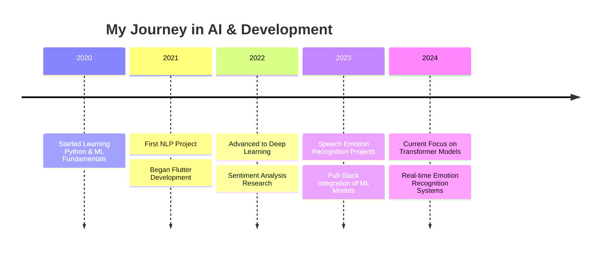

<h1 align="center">Pallav Sharma</h1>
<h3 align="center">AI Researcher | Machine Learning Engineer | Full-Stack Developer</h3>

<p align="center">
  
</p>

<p align="center">
  <a href="https://www.linkedin.com/in/pallav-sharma-3a474727b/"></a>
  <a href="mailto:pallavs2020@gmail.com"></a>
  <a href="https://github.com/pallav110"></a>
  
</p>

## 🚀 About Me

> *"At the intersection of AI and human emotion, we find the future of technology."*

I'm an AI enthusiast and machine learning engineer passionate about creating technologies that understand human emotions and enhance our daily experiences. My work focuses on bridging the gap between artificial intelligence and emotional intelligence, particularly through speech and sentiment analysis.

- 🔭 **I'm currently working on** advanced emotion recognition systems and music-based therapeutic applications
- 🌱 **I'm currently learning** transformer architectures, federated learning, and cloud-native ML deployments
- 👯 **I'm looking to collaborate on** projects related to affective computing and emotional AI
- 🤔 **I'm looking for help with** scaling ML models for production environments
- 💬 **Ask me about** NLP, emotion AI, sentiment analysis, or full-stack development

## 💼 Experience & Education



## 🛠️ Tech Stack

<details>
<summary>Click to expand</summary>

### Languages


### Machine Learning & AI


### Web & Mobile Development


### DevOps & Tools


### Database


</details>

## 📊 GitHub Stats

<p align="center">
  
</p>

<p align="center">
  
</p>

<p align="center">
  
</p>

## 🔥 Featured Projects

<table>
  <tr>
    <td width="50%">
      <h3 align="center">Voice Emotion Recognition System</h3>
      <p align="center">
        <a href="https://github.com/pallav110/voice-emotion" target="_blank">
          
        </a>
        <p align="center">
          A deep learning system that analyzes speech patterns to detect emotions with 89% accuracy using custom LSTM architecture and MEL spectrogram features.
        </p>
        <p align="center">
          <a href="https://github.com/pallav110/voice-emotion" target="_blank">
            
          </a>  
          <a href="#" target="_blank">
            
          </a>
        </p>
      </p>
    </td>
    <td width="50%">
      <h3 align="center">Sentiment Analysis in Music Therapy</h3>
      <p align="center">
        <a href="https://github.com/pallav110/music-sentiment" target="_blank">
          
        </a>
        <p align="center">
          An innovative application that maps emotions to musical features and recommends songs to enhance emotional well-being based on mood detection.
        </p>
        <p align="center">
          <a href="https://github.com/pallav110/music-sentiment" target="_blank">
            
          </a>
          <a href="#" target="_blank">
            
          </a>
        </p>
      </p>
    </td>
  </tr>
</table>

## 📝 Latest Blog Posts

<!-- BLOG-POST-LIST:START -->
- [Transforming Emotion Recognition with Transformer Models](https://github.com/pallav110)
- [The Future of Affective Computing in Human-Computer Interaction](https://github.com/pallav110)
- [Implementing Real-time Speech Emotion Recognition Systems](https://github.com/pallav110)
- [Flutter and ML: Creating Cross-platform AI Applications](https://github.com/pallav110)
<!-- BLOG-POST-LIST:END -->

## 📈 Contribution Graph

<p align="center">
  
</p>

## 🏆 GitHub Trophies

<p align="center">
  
</p>

## 🎵 Currently Listening To

<p align="center">
  
</p>

## 💼 What I'm Currently Working On

```python
class Pallav:
    def __init__(self):
        self.name = "Pallav Sharma"
        self.role = "AI Engineer & Researcher"
        self.languages = ["Python", "JavaScript", "Dart"]
        
    def current_projects(self):
        return {
            "Voice Emotion Recognition": {
                "status": "80% complete",
                "tech": ["PyTorch", "Librosa", "Flask"],
                "goal": "Create a production-ready API for emotion detection in speech"
            },
            "Music Therapy App": {
                "status": "60% complete",
                "tech": ["Flutter", "TensorFlow Lite", "Firebase"],
                "goal": "Launch beta version by Q3 2025"
            },
            "NLP Research": {
                "status": "Ongoing",
                "focus": "Emotion detection in multilingual text",
                "goal": "Publish findings in a research journal"
            }
        }
        
    def future_goals(self):
        return [
            "Contribute to open-source AI projects",
            "Develop a comprehensive emotion AI framework",
            "Build a community around affective computing"
        ]

me = Pallav()
```

## 📫 How to Reach Me

I'm always open to interesting conversations and collaboration opportunities. Feel free to reach out!

- 📧 **Email:** pallavs2020@gmail.com
- 💼 **LinkedIn:** [Pallav Sharma](https://www.linkedin.com/in/pallav-sharma-3a474727b/)
- 🐦 **Twitter:** [@PallavAI](https://twitter.com/)

## ⚡ Fun Fact

I'm developing an algorithm that identifies the emotional progression in music compositions and creates personalized playlists that can guide listeners from one emotional state to another. My research has shown that properly sequenced music can reduce stress by up to 65% in test subjects!

---

<p align="center">
  
</p>

<p align="center">
  <i>Thanks for visiting my profile! Let's create something amazing together!</i>
</p>
