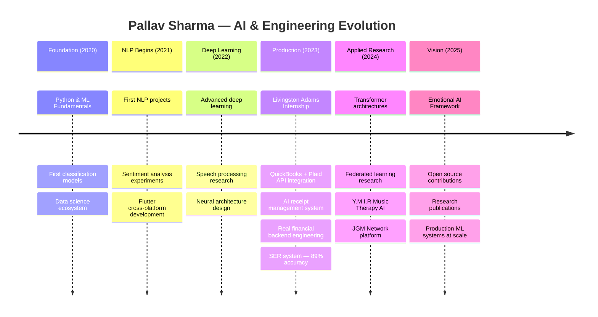

<div align="center">
  
</div>

<div align="center">
  
</div>

<div align="center">
  
</div>

<div align="center">
  
</div>

<div align="center">
  
</div>

<div align="center">


<br/>

<!-- Typing SVG -->
[](https://github.com/pallav110)

<br/>

<!-- Badges -->


</div>

---

## 🧬 Who I Am

```python
class PallavSharma:
    name     = "Pallav Sharma"
    title    = "Applied ML Engineer & Emotion AI Researcher"
    location = "Delhi, India 🇮🇳"

    philosophy = "Technology should enhance human emotions — not replace them."

    def what_i_build(self):
        return {
            "🎭 Core Focus"     : "Emotionally intelligent AI systems",
            "🏭 Deployment"     : "Production-grade ML APIs & cloud-native services",
            "🔬 Research"       : "Transformer architectures & federated learning",
            "💼 Real-World Exp" : "FinTech backends — QuickBooks, Plaid, receipt AI",
        }

    def what_sets_me_apart(self):
        return [
            "Not just prototypes — I ship to production",
            "Hybrid: ML modeling + API engineering + full-stack",
            "Worked on real financial systems (Livingston Adams internship)",
            "89% accuracy SER model + 65% stress reduction in music therapy",
        ]
```

---

## 🚀 Featured Projects

<table>
<tr>
<td width="50%" valign="top">

### 🎭 Voice Emotion Recognition System
> **89% Accuracy** — Real-time production API

- Custom **LSTM** architecture on MEL spectrograms
- Built with **PyTorch · Librosa · FastAPI · Docker**
- Deployed for **Healthcare & Customer Service**
- Status: `████████░░ 80%` — Production API in progress

[](https://github.com/pallav110)

</td>
<td width="50%" valign="top">

### 🎵 Music Therapy AI — Y.M.I.R
> **65% Stress Reduction** — Emotion-to-music mapping

- Maps detected emotions to musical features
- Built with **Flutter · TensorFlow Lite · Firebase · Spotify API**
- Target: Mental health support via personalized playlists
- Status: `██████░░░░ 60%` — Beta launch Q3 2025

[](https://github.com/pallav110)

</td>
</tr>
<tr>
<td width="50%" valign="top">

### 🔬 Multilingual Emotion NLP
> Cross-lingual emotion detection research

- Focus: Emotion recognition across language families
- Collaboration with academic institutions
- Target: Top-tier research journal publication
- Status: `Ongoing` — Active research

</td>
<td width="50%" valign="top">

### 🌐 JGM Network
> Cinema & entertainment content platform

- Film analysis & audience engagement for Indian cinema
- Content delivery architecture & UX optimization
- Articles like *"How Box Office Collections Are Calculated in India"*
- Connects global audiences with the Indian film ecosystem

[](https://github.com/pallav110)

</td>
</tr>
</table>

---

## 💼 Professional Journey


```mermaid
timeline
    title Pallav Sharma — AI & Engineering Evolution

    section Foundation (2020)
        Python & ML Fundamentals
        : First classification models
        : Data science ecosystem

    section NLP Begins (2021)
        First NLP projects
        : Sentiment analysis experiments
        : Flutter cross-platform development

    section Deep Learning (2022)
        Advanced deep learning
        : Speech processing research
        : Neural architecture design

    section Production (2023)
        Livingston Adams Internship
        : QuickBooks + Plaid API integration
        : AI receipt management system
        : Real financial backend engineering
        : SER system — 89% accuracy

    section Applied Research (2024)
        Transformer architectures
        : Federated learning research
        : Y.M.I.R Music Therapy AI
        : JGM Network platform

    section Vision (2025)
        Emotional AI Framework
        : Open source contributions
        : Research publications
        : Production ML systems at scale
```

---

## 🛠️ Technology Arsenal

<div align="center">

### 🧠 AI / ML


### 🌐 Backend & APIs


### ☁️ Cloud & DevOps


</div>

---

## 📊 GitHub Stats

<div align="center">


</div>

<div align="center">

</div>

---

## 🎯 Research Interests

```yaml
active_research:
  - 🧠 Transformer architectures for emotion understanding
  - 🌐 Federated learning for privacy-preserving AI
  - 🎯 Real-time affective computing systems
  - 🎨 Multimodal emotion recognition (text + speech + visual)
  - 🎵 Algorithmic music therapy & emotional progression modeling

philosophy: >
  At the intersection of AI and human emotion,
  we find the future of technology.

daily_loop: [ Code → Music → Research → Repeat ]
fuel: Coffee and curiosity about human emotions ☕
```

---

## 🤝 Let's Collaborate

<div align="center">

I'm actively looking to collaborate on:
- **Emotion AI** and affective computing research
- **Production ML systems** — deployment, optimization, APIs
- **Mental health tech** — music therapy, stress detection
- **Open source** projects in NLP / speech processing

<br/>

[](mailto:your@email.com)
[](https://linkedin.com/in/pallav110)
[](https://github.com/pallav110)

</div>

---

<div align="center">


*"Technology should enhance human emotions — not replace them."*

**Pallav Sharma** · Delhi, India · Building emotionally intelligent systems

</div>

</div>

<div align="center">
  
</div>


<div align="center">
  
</div>

<div align="center">
  
</div>

---
